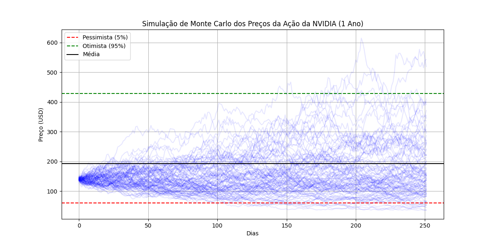
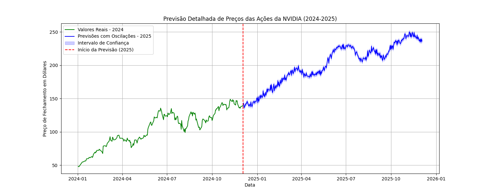
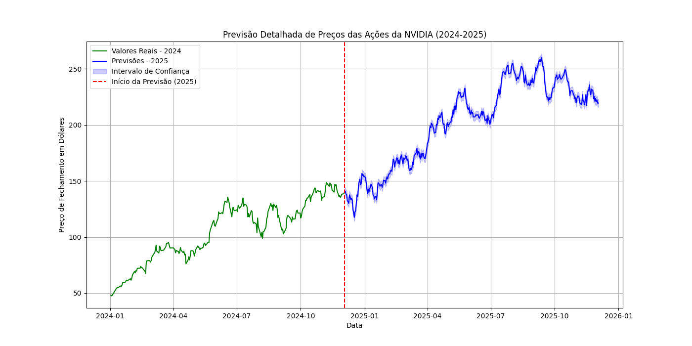

# Análise Preditiva das Ações da Nvidia

Este projeto explora a aplicação de **Data Science**, **Machine Learning** e **Deep Learning** para prever os preços das ações da **Nvidia** até o final de **2025**. O objetivo é oferecer uma visão abrangente de diferentes abordagens preditivas, avaliando a eficácia de cada modelo em capturar a complexidade do mercado financeiro.

---

## Motivação

O mercado de ações é notoriamente volátil, tornando a previsão de preços um desafio intrigante e complexo. Neste projeto, investiguei como diferentes técnicas podem ser aplicadas para modelar e prever as ações da Nvidia. A ideia é não apenas buscar precisão nas previsões, mas também explorar os limites de cada abordagem.

---

## Abordagem
Foram utilizados diversos modelos de **Machine Learning** e **Deep Learning** para atender ao desafio, incluindo:

### Modelos Testados
- **TensorFlow** (Google): Framework versátil para construção e treinamento de redes neurais avançadas.
- **PyTorch** (Meta): Outro framework poderoso para desenvolvimento de modelos baseados em redes neurais.
- **LSTM**: Redes neurais recorrentes avançadas, eficazes na captura de padrões temporais de longo prazo em séries temporais.
- **Scikit-learn**: Ferramenta amplamente utilizada para preprocessamento de dados e avaliação de modelos estatísticos.
- **ARIMA**: Modelo clássico para séries temporais, focado em capturar tendências simples e sazonalidades.
- **Prophet** (Meta): Modelo especializado em previsão de séries temporais, com suporte a tendências, sazonalidades complexas e eventos externos.
- **NeuralProphet** (Meta): Variante do Prophet que incorpora funcionalidades adicionais, como aprendizado baseado em redes neurais.
- **Análise de Monte Carlo**: Técnica estatística para simulação de múltiplos cenários e análise de riscos probabilísticos.

### Modelos Selecionados para o Resultado Final
Após uma análise detalhada de desempenho e adequação ao conjunto de dados financeiros, os seguintes modelos foram selecionados para compor os resultados finais:

**1 - LSTM (Deep Learning)**: Demonstrou excelente capacidade de capturar padrões complexos e oscilações históricas, proporcionando previsões que refletem a volatilidade do mercado financeiro.

**2 - Prophet (Machine Learning)**: Escolhido por sua habilidade em prever tendências e sazonalidades, com ajustes para oscilações realistas, gerando resultados robustos e interpretáveis.

**3 - Análise de Monte Carlo (Estatística)**: Utilizada para avaliar probabilidades de diferentes trajetórias, destacando cenários pessimistas, otimistas e médios, com uma visão probabilística dos riscos e oportunidades.

### Justificativa
Apesar de todos os modelos terem sido testados, nem todos se mostraram adequados para o contexto de dados financeiros e as metas do projeto. Modelos como PyTorch, ARIMA e NeuralProphet apresentaram limitações na captura de padrões complexos ou precisão das previsões para este conjunto de dados. Assim, a seleção final foi baseada em desempenho preditivo, adaptabilidade ao contexto financeiro e interpretabilidade.

---

## Resultados

### 1. **Análise Estatística de Monte Carlo**

A análise de Monte Carlo simulou 1 milhão de cenários possíveis, levando em conta choques aleatórios e volatilidade histórica. Os resultados são:

- **Cenário otimista**: Crescimento de **206%**
- **Cenário pessimista**: Queda de **-57%**
- **Crescimento médio previsto**: **37%**

A abordagem forneceu uma perspectiva detalhada de diferentes possíveis trajetórias para as ações da Nvidia, destacando a amplitude dos cenários.

---

### 2. **Previsão com Machine Learning (Prophet do Facebook)**

Utilizando o modelo **Prophet**, focado em componentes sazonais e tendências, os resultados indicam um aumento estimado de **72,8%** até o último dia de **2025**. O modelo também apresentou um bom ajuste para oscilações realistas.

---

### 3. **Previsão com Deep Learning (LSTM)**

O modelo **LSTM**, com sua capacidade de lidar com padrões temporais complexos, previu um aumento de **56,5%** até o final de **2025**. Ele foi capaz de capturar as oscilações históricas de forma satisfatória, refletindo a realidade do mercado.

---

## Conclusão

Cada abordagem apresentou suas forças e limitações:

- **Monte Carlo** destacou-se pela análise probabilística e amplitude dos cenários.
- **Prophet** entregou previsões robustas e explicáveis.
- **LSTM** capturou oscilações detalhadas, tornando-se ideal para simular variações realistas.

Na minha opinião, o modelo **LSTM** apresentou o melhor equilíbrio entre realismo e previsibilidade, preservando as oscilações históricas e capturando tendências de longo prazo.

E aí, qual modelo você acha que se sairá melhor em 2025? Vamos acompanhar o mercado e descobrir juntos!

---

## Licença
Este projeto está sob a licença MIT. Sinta-se à vontade para utilizá-lo e contribuir!

---

## Contribuições
Contribuições são bem-vindas! Abra uma issue ou envie um pull request com suas melhorias.

